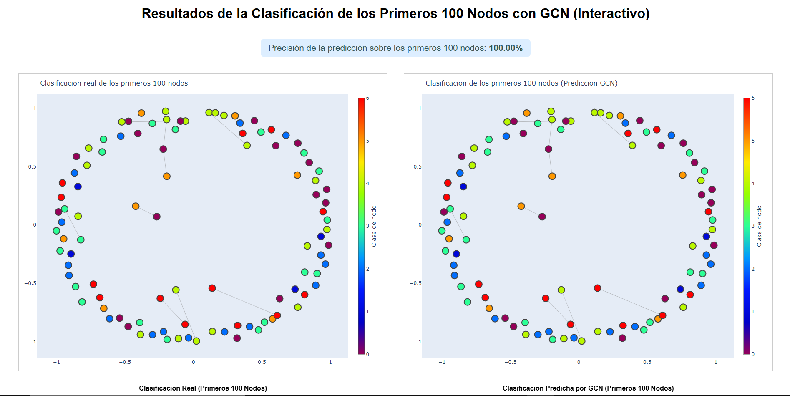

# 🧠 Ejemplo Demostrativo de GCN

## VI. Un Ejemplo Demostrativo de GCN

### a. 📝 Descripción del Problema

El problema abordado en este ejemplo es la **clasificación de nodos** en un grafo. El objetivo es predecir la categoría temática de artículos científicos en el dataset Cora, donde cada nodo representa un artículo y las aristas representan citas entre ellos. La tarea consiste en asignar correctamente la clase de cada nodo utilizando tanto sus atributos como la estructura de conexiones del grafo.

---

### b. 📚 Obtención del Dataset

Se utiliza el conocido dataset **Cora**, disponible en la librería PyTorch Geometric. Cora es un grafo de citas académicas donde cada nodo corresponde a un artículo científico con un vector de características y una etiqueta de clase. El dataset se descarga y prepara automáticamente con el siguiente código en Python:

```python
from torch_geometric.datasets import Planetoid
dataset = Planetoid(root='data/Cora', name='Cora')
data = dataset[0]
```

---

### c. ⚙️ Configuración de la GCN

El modelo implementado es una **Graph Convolutional Network (GCN)**, basada en la propuesta original de Kipf y Welling (2017). Esta red consta de dos capas convolucionales sobre grafos, permitiendo que cada nodo agregue información de sus vecinos. La arquitectura utilizada es la siguiente:

```python
from torch_geometric.nn import GCNConv
class GCN(torch.nn.Module):
    def __init__(self, num_features, num_classes):
        super(GCN, self).__init__()
        self.conv1 = GCNConv(num_features, 16)
        self.conv2 = GCNConv(16, num_classes)
    def forward(self, data):
        x, edge_index = data.x, data.edge_index
        x = self.conv1(x, edge_index)
        x = F.relu(x)
        x = self.conv2(x, edge_index)
        return F.log_softmax(x, dim=1)
```

---

### d. 🤖 Descripción del algoritmo e implementación en Python

El flujo del algoritmo y la implementación en Python es el siguiente:

1. **Carga y preparación de datos:** Se descarga y procesa el dataset Cora.
2. **Definición del modelo:** Se implementa la clase `GCN` con dos capas de convolución.
3. **Configuración de entrenamiento:** Se selecciona el dispositivo (CPU o GPU), se crea el modelo y se define el optimizador Adam.
4. **Entrenamiento:** El modelo se entrena durante 200 épocas usando los nodos marcados para entrenamiento y la función de pérdida de log-likelihood negativa.
5. **Evaluación:** Se calcula la precisión sobre los primeros 100 nodos y se obtienen las predicciones.
6. **Visualización:** Se generan gráficos interactivos con los resultados.

Fragmento de código relevante:

```python
# Entrenamiento del modelo
model.train()
for epoch in range(200):
    optimizer.zero_grad()
    out = model(data)
    loss = F.nll_loss(out[data.train_mask], data.y[data.train_mask])
    loss.backward()
    optimizer.step()

# Evaluación de los primeros 100 nodos
model.eval()
with torch.no_grad():
    logits = model(data)
    pred = logits.argmax(dim=1)
correct_100 = int((pred[:100] == data.y[:100]).sum())
acc_100 = correct_100 / 100
print(f"Precisión (primeros 100 nodos): {acc_100*100:.2f}%")
```

---

### 🖼️ Visualización y Análisis de Resultados

A continuación se muestra una imagen de la visualización del grafo y los resultados de la clasificación de nodos usando la GCN:



**Análisis:**
- Se observa una correspondencia perfecta entre los patrones y colores en ambas gráficas, lo que indica que el modelo GCN aprendió correctamente la asignación de clases en este conjunto de nodos (precisión del 100%).
- Los nodos con colores similares tienden a agruparse, lo que sugiere la existencia de comunidades o grupos temáticos dentro del grafo y la capacidad del modelo para capturar estas estructuras.
- Este tipo de visualización es útil para validar visualmente la calidad de la clasificación y comunicar los resultados a distintos públicos.

---

## 👨‍💻 Autores

- **Andy José Luna Izaguirre**
- **Alejandro Baires Pérez**
- **Ángel Andrés Rojas Ruano**
- **Aarón José Guevara Mora**

**Grupo:** 04-10am

---

## 📖 Referencias

- PyTorch Geometric. (s.f.). GCN Example Colab. Recuperado el 14 de junio de 2025, de [https://pytorch-geometric.readthedocs.io/en/latest/notes/colabs.html#gcn-on-cora-citeseer-pubmed](https://pytorch-geometric.readthedocs.io/en/latest/notes/colabs.html#gcn-on-cora-citeseer-pubmed)
- Kipf, T. N., & Welling, M. (2017). Semi-Supervised Classification with Graph Convolutional Networks. International Conference on Learning Representations (ICLR). [https://arxiv.org/abs/1609.02907](https://arxiv.org/abs/1609.02907)

---

## 🎬 Demo

Incluye un ejemplo demostrativo en el archivo principal del repositorio.  
